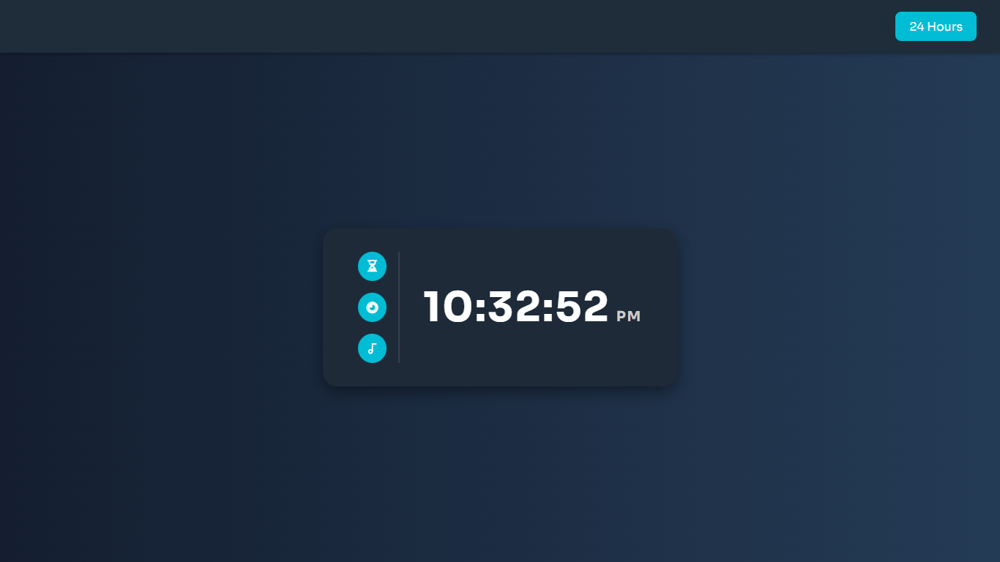

# 🕒 Real-Time Digital Clock Web App

This project is a **real-time digital clock** built using HTML, CSS, and JavaScript. It demonstrates the use of JavaScript **Date objects and methods**, which I recently learned. The clock displays the current time and updates every second.

## ✨ Features

- ⏱️ Live time display (Hours, Minutes, Seconds)
- 🔄 Toggle between **12-hour** and **24-hour** formats
- 🧠 Button dynamically updates its text based on current format
- ⚡ Smooth and responsive user experience
- 🌱 More features will be added as I continue learning

## 🧪 How It Works

- The app uses `Date()` to fetch the current time.
- It updates every second using `setInterval()`.
- A toggle button in the navigation bar switches between **12-hour** and **24-hour** time formats.
- When clicked:
  - If time is in 12-hour format, it switches to 24-hour.
  - If time is in 24-hour format, it switches to 12-hour.
  - The button text updates accordingly.
- 📱 Mobile responsiveness

## 📸 Preview

## 🛠️ Technologies Used

- HTML5
- CSS3
- JavaScript (ES6)

## 🚧 Future Plans

As I continue learning, I plan to add:

- 🌓 Dark/Light mode toggle
- 🌍 Timezone selection
- ⏰ Alarm feature
- 📅 Date display

## 🙌 Contribution

This is a learning project, but feedback or suggestions are always welcome!

---

**Made with ❤️ by [Praduman Gupta]**
